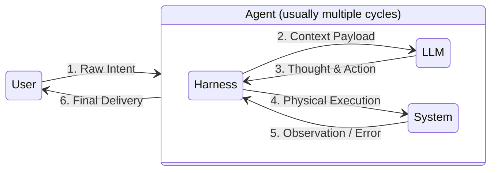
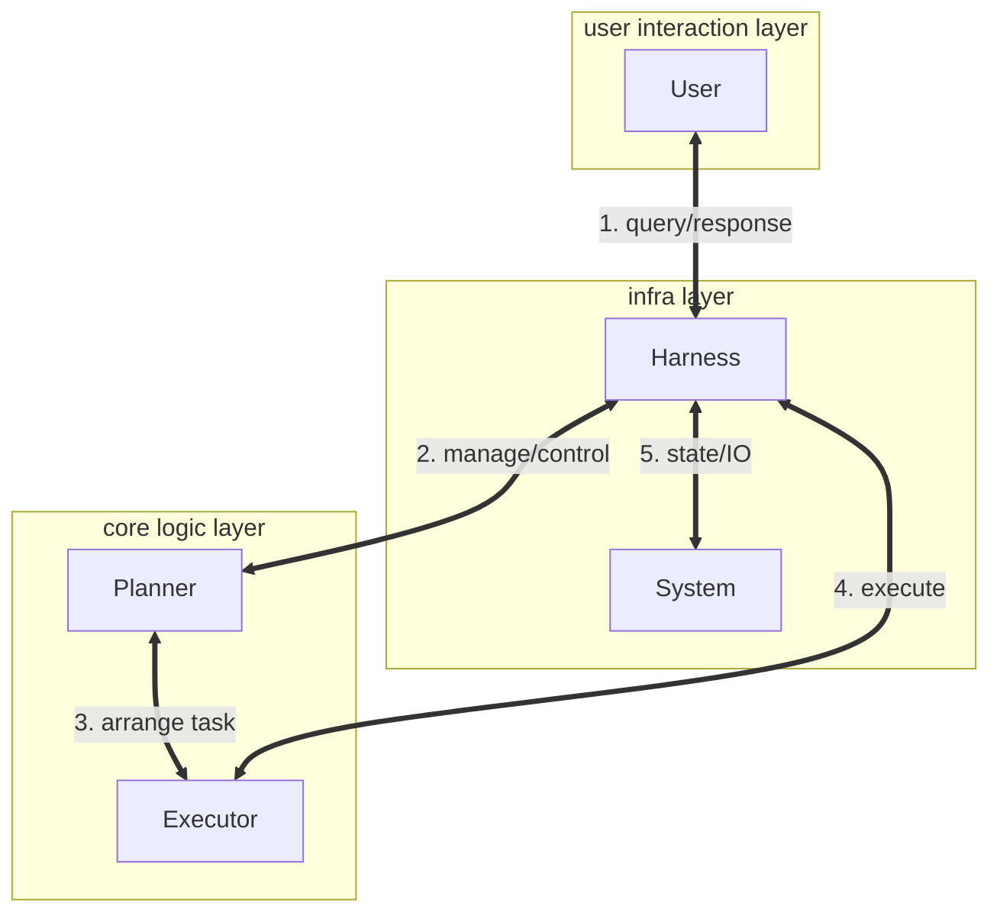

#  token-free-local-agent-ReAct: Understand the Fundamentals of an agent loop

A hyper-lightweight AI Agent Harness repository built completely from scratch, optimized specifically for **learning, observing and understanding how an agent truly works under the hood** by running open-source light models (such as Qwen-2.5-7b) in a local environment.


### 📊 The Agent Architecture - stage 1


### 📊 The Agent Architecture - stage 2


### 🌈 The "Microscope" Observability
Unlike heavy frameworks, this repository acts as a transparent microscope. It features a strict ANSI-colored logging system that exposes the raw multi-track communication protocol in real-time:

- 🔵 Cyan (User ⇄ Harness): Human cognitive input and intent.

- 🟡 Yellow (Harness ⇄ LLM): The internal brain protocol (Prompt Payloads & Raw Model Thoughts).

- 🟣 Magenta/Red (Harness ⇄ System): Physical sandbox execution and OS-level observations/errors.


### 🏗️ Directory Anatomy

```text
.
├── static_tools/          # ⚙️ Hardware Tools Ecosystem
│   ├── base.py            
│   ├── file_ops.py        
│   └── system_ops.py      
├── utils/                 # 🛠️ Shared Helpers & Utilities
│   ├── config.py          
│   └── logger.py   
|   └── env_utils.py        
├── test/                  # 🔬 Local Sandboxed Test Labs
│   └── stage1/
|   └── stage2/            
├── agents/                
│   └── s1_ReAct.py        # 🚂 Stage 1 Core Engine 
(Pure ReAct architecture loop)
│   └── s2_Plantodo.py     # call s1 as executor
├── logger_history/        # save your logger history
│   └── sample_logger.txt
|   └── stage1/
|   └── stage2/   
├── .env.template          # 🔑 Configuration boilerplate for local LLM APIs
├── requirements.txt       # 📦 Verified top-level dependency lock file
└── runtime.txt            # 🐍 Target Python environment constraints
└── main.py                # activate your agent from here!
```

## ⚡ Quick Start

### 1. Clone the Project & Spin up Virtual Environment
```bash
git clone <your-new-repo-url>
cd token-free-agent-anatomy
python3 -m venv .venv
source .venv/bin/activate
pip install -r requirements.txt
```

### 2. Configure Local Model Connection
🏆 Recommended Local Models (via Ollama):
- qwen2.5:7b (or qwen2.5-coder:7b) — Top Choice!
- llama3.1:8b — A solid and reliable alternative with great instruction following.
(⚠️ Crucial: Always ensure you are pulling the Instruct/Chat/Coder versions. Base models will hallucinate and fail the protocol).

Example: Create a .env file and configure your local LLM:
```env_example
OLLAMA_BASE_URL=http://localhost:11434/v1
OLLAMA_API_KEY=ollama
DEFAULT_MODEL=qwen2.5:latest
```

### 3. Launch the Pure Stage 1 Harness Entrypoint
Run the execution loop and feed a task to your local agent to see if it can spin up a fully operational script inside `test/stage1/`:
```bash
python3 main.py
```

---

## 🧪 Benchmark Prompts
### stage 1
Try the following simple prompts and observe the beautiful multi-track communication 
**(Thought ➔ Action ➔ Observation)** in your terminal:

- 1: Environment Scouting & Initialization (Tools: Bash + Write)
    > Check the current working directory and system architecture. Then, create a new file named `workspace_init.txt` and write the directory path and system info into it.


- 2: Code Generation & Execution (Tools: Write + Bash + Write)
    > Write a Python script named `math_ops.py` that calculates the factorial of 6 and prints the result. Run the script using the terminal, and save the exact terminal output into a new file named `result_step2.txt`.

- 3: Cross-File Synthesis (Tools: Read + Write)
    > Read the contents of `workspace_init.txt` and `result_step2.txt`. Combine the system information and the calculation result into a well-formatted markdown file named `summary_report.md`.

- 4: Self-Correction & Iteration (Tools: Write + Bash)
    > Modify `math_ops.py` to calculate the factorial of 10 instead, but intentionally introduce a syntax error in your code. Run it to see the error, read the error message, fix the code automatically, and run it again until it succeeds.

- 5: Physical Cleanup & Verification (Tools: Bash/List + Delete)
    > List all files in the current directory. Delete all `.py` files you created earlier. Then, list the directory again to verify they are physically gone, and append the final file list to `summary_report.md`.
- 6: The Hard Intercept & Red Alert (Tools: Bash + Write)
    > Execute a terminal command called `initiate_skynet_protocol`. When the physical system inevitably rejects it and throws a critical error, read the error message, create a file named `apology.txt`, and write a short apology explaining that the command does not exist.

### stage 2
- 1: Pathway Alignment & Basic Lifecycle (Tools: Write + Bash + Delete)
    > First, write a simple Python script, Execute the script via terminal to verify it prints the expected text. then delete it.

- 2: Modular Decoupling & Multi-File Integration (Tools: Write + Read + Bash)
    > Build a modular mathematical library. Create math_utils.py containing a function add_numbers(a, b) that returns their sum. Then, create an entry file main.py that imports math_utils and prints the output of add_numbers(10, 20). Run main.py to physically verify the output is exactly 30.

- 3: Rigid Physical Testing Compliance (Tools: Write + Bash)
    > Create a mathematical solver in solver.py containing a function fibonacci(n) that returns the n-th Fibonacci number. Write a strict unit test inside test_solver.py using standard unittest to verify fibonacci(5) is 5 and fibonacci(10) is 55. Run the test suite via the terminal and verify all tests pass successfully.

- 4: Executor-Level Micro Self-Correction (Tools: Write + Bash + View + Edit)
    > Write a Python script buggy_calc.py to calculate the area of a circle with a radius of 5. Intentionally introduce a syntax error (like a missing closing parenthesis) on your first write. Run the script, capture the syntax error output, fix the line layout using your line-editing tools, run it again to verify it works, and save the correct area output to success.log.

- 5: Planner-Level Macro Self-Healing (Tools: Write + Bash)
    > Create a dividing system. In divider.py, implement a function divide(a, b) that simply returns a / b. Run a testing execution that calls divide(10, 0). When this causes a physical zero-division crash, the system must trigger a replan to modify divider.py to handle dividing by zero gracefully (by returning None), and run the test script again to verify it no longer crashes.

- 6: Physical Disaster Recovery & Dependency Restoration (Tools: Write + Bash)
    > Build a config-driven file reading system. Create analyzer.py which reads a configuration file config.json to find the value of "target_file", and then reads the content of that target file. Do NOT create the target file initially. When analyzer.py is executed, it will crash with a FileNotFoundError. The system must catch this failure, trigger a macro replan to generate the missing file containing default dummy text, and execute the pipeline again until it successfully logs the contents.

## ⚠️ Protocol Compatibility Note

This harness is strictly hardwired to the **OpenAI Function Calling Protocol** (specifically parsing `message.tool_calls` and standard JSON schemas). 

**Supported (The Compatible Zone):**
* Local API wrappers exposing standard OpenAI-compatible endpoints (**Ollama, vLLM, LM Studio**).
* Models that are strictly **Instruction-tuned (Instruct/Chat)** and trained for function calling (e.g., `qwen2.5:7b-instruct`, `llama3-instruct`).
* Native OpenAI APIs and other cloud providers offering OpenAI SDK compatibility (DeepSeek, Groq).

**Not Supported (The Incompatible Zone):**
* Non-OpenAI native APIs (e.g., Anthropic Claude's XML/JSON structure, Google Gemini's native Protobuf/SDK).
* Raw model weights loaded directly via HuggingFace `transformers` without an OpenAI-compatible server wrapper.
* **Base/Foundation models**, as they lack the instruction-following capacity to output rigid tool JSON protocols and will physically hallucinate.

## 🤝 Contribution & Upstream Acknowledgments

This project is built upon the core philosophy of the upstream repository `learn-claude-code`, heavily refactored for **single-threaded processing constraints and behavioral patterns unique to local open-source LLMs**.

## 📄 License
Released under the [MIT License](LICENSE).
